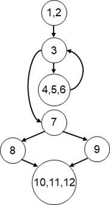

 

<frontmatter>
  layout: default.md
  pageNav: 2
  pageNavTitle: "Chapters of This Page"
</frontmatter>

Control Flow Graph (CFG)
===================================================

A Control Flow Graph (CFG) is a compact and intuitive representation of all control flow paths in a program.

Nodes in the CFG are called basic blocks, which contains statement numbers that are known to be executed one by one in sequence.

Basic blocks are formed of maximal program region with a single entry and single exit point or maximal code fragments executed without control transfer. That is, a decision point in 'while' or 'if' always marks the end of a basic block.

We only need to explicitly show control flows among basic blocks using directed edges. Directed edges in CFG show the possibility that program execution proceeds from the end of one region directly to the beginning of another.

An example of CFG for [Code 6](#code-6) is shown in [Figure 5](#figure-5-cfg-for-procedure-second-in-code-6).

For simplicity, procedures `First` and `Third` are excluded from statement numbering.

##### Code 6

          procedure First {
          read x;
          read z;
          call Second; }

          procedure Second {
    01        x = 0;
    02        i = 5;
    03        while (i!=0) {
    04            x = x + 2*y;
    05            call Third;
    06            i = i - 1; }
    07        if (x==1) then {
    08            x = x+1; }
              else {
    09            z = 1; }
    10        z = z + x + i;
    11        y = z + 2;
    12        x = x * y + z; }

          procedure Third {
              z = 5;
              v = z;
              print v; }

###### Figure 5: CFG for procedure Second in [Code 6](#code-6)

Do note that:

1.  There is one CFG per procedure.

2.  The while statement (head) should be in a separate node from other statements in the loop (body).

3.  Dummy nodes can be used (but not excessively) to show that

    *   if statements in the CFG have a diamond shape
    *   while loops have a loop shape
    *   procedure ends
