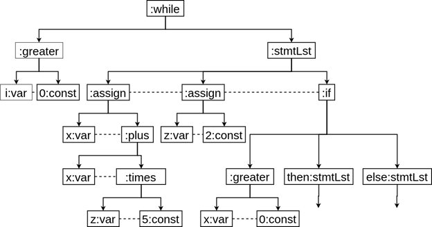
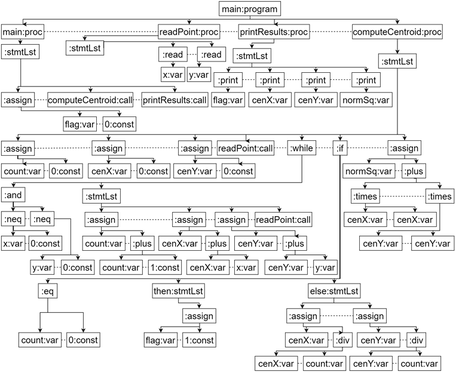
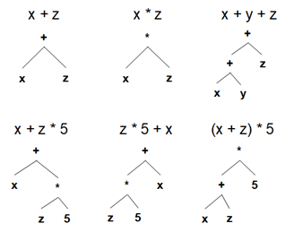

 

<frontmatter>
  layout: default.md
  pageNav: 2
  pageNavTitle: "Chapters of This Page"
</frontmatter>

Abstract Syntax Tree (AST)
=======================================================

An AST is a tree representation of the abstract syntactic structure of source code written in a programming language. Each node of the tree denotes a construct occurring in the source code. The syntax is "abstract" in not representing every detail appearing in the real syntax. For instance, grouping parentheses are implicit in the tree structure, and a syntactic construct like an if-condition-then expression is denoted by means of a single node with two branches.

There are core requirements when representing information in the AST:

*   The order of executable statements must be explicitly represented and well defined.
*   Left and right components of binary operations must be stored and correctly identified.
*   Identifiers and their assigned values must be stored for assignment statements.

AST is a schematic representation in the format of a tree of the SIMPLE program. The nodes typically correspond with the non-terminals of the syntax grammar. The directed edges appear for each grammar rule (production).

[Figure 2](#figure-2-ast-fragment-of-a-while-loop) shows a simplified representation of an AST for the while statement in the following code fragment:

    while (i > 0) {
        x = x + z * 5;
        z  = 2;
        if (x > 0) then { ... } else { ... }
    }

##### Figure 2: AST fragment of a while loop

Formally, AST nodes are labeled with values (procedure names, variable names, constants etc.) and syntactic types. These are placed before after `:` respectively. For example, node `readPoint:call` represents a call to the procedure `readPoint`, and node `cenX:variable` represents a variable `cenX`.

[Figure 3](#figure-3-full-ast-for-code-4) shows a full AST for program Main in [Code 4](#code-4-program-with-multiple-procedures-in-simple) example.

##### Code 4: Program with multiple procedures

        procedure main {
    01      flag = 0;
    02      call computeCentroid;
    03      call printResults;
        }
        procedure readPoint {
    04      read x;
    05      read y;
        }
        procedure printResults {
    06      print flag;
    07      print cenX;
    08      print cenY;
    09      print normSq;
        }
        procedure computeCentroid {
    10      count = 0;
    11      cenX = 0;
    12      cenY = 0;
    13      call readPoint;
    14      while ((x != 0) && (y != 0)) {
    15          count = count + 1;
    16          cenX = cenX + x;
    17          cenY = cenY + y;
    18          call readPoint;
            }
    19      if (count == 0) then {
    20          flag = 1;
            } else {
    21          cenX = cenX / count;
    22          cenY = cenY / count;
            }
    23      normSq = cenX * cenX + cenY * cenY;
        }

##### Figure 3: Full AST for Code 4

The graphical representation is flexible, as long as nodes of the tree are correct and the links in the tree match the SIMPLE program. For example, you may simplify the representation of a :plus node to a simple "+" sign in AST that correctly connects with the other elements of the assignment. [Figure 4](#figure-4-example-asts-for-expressions) shows a few ASTs for expressions containing plus and times operations in simplified representation. Note again that expressions are left-associative (see AST for `x+y+z` below).

##### Figure 4: Example ASTs for expressions

Observe that the AST is built strictly according to abstract syntax grammar rules for SIMPLE. Each non-leaf node corresponds to a syntactic type on the left-hand-side of some grammar rule, and its children nodes correspond to the syntactic types on the right-hand-side of that grammar rule. For any unambiguously defined language, each well-formed program corresponds to exactly one AST. A node is a child of another node if it appears directly below it in AST. Child relationship is shown as a solid edge in Figures 2, 3 and 4.
