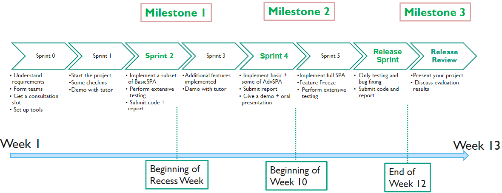

 

<frontmatter>
  layout: default.md
  pageNav: 2
  pageNavTitle: "Chapters of This Page"
</frontmatter>

Project Management
=========================================

Project management is the process of leading and structuring work so that teams can achieve their goals and objectives. This involves everything from motivation to tracking progress to resolving potential issues and bottlenecks.

Software project management, specifically, is dedicated to planning, task management, tracking, and resource allocation for software projects. It differs from traditional project management in the sense that software development projects have a unique lifecycle.

This unique lifecycle requires rounds of testing, as well as constant updating based on stakeholder and or customer feedback.

1\. Agile Project Management - Scrum
===========================================================================

Most software teams use agile project management. Agile is an iterative approach that aims for teams to deliver value to their customers faster and with fewer bumps in the road.

Instead of delivering everything at once, an agile team delivers work in smaller sets, typically called ‘sprints.’

As opposed to having to wait until the end of the project for reviews and amendments (the linear approach), agile software project management allowed team members to respond quickly and effectively to changes and updates.

Agile has given way to the birth of other sub-frameworks as well, such as kanban, scrum, and lean.

Scrum is an agile process that is very common in software development and product development. It’s also a framework that can easily be applied to multiple types of projects.

With scrum, iterations consist of short sprints lasting anywhere between 2 to 4 weeks.

During these sprints, the goal is to prioritize building the most important features first and then moving on from there.

Teams that use this type of project management methodology are led by a Scrum Master during each sprint. The scrum master is kind of the leader of the pack.

The team’s performance is reviewed at the end of each sprint during a ‘sprint retrospective,’ allowing teams to implement any needed changes before the next sprint.

This type of methodology is great for teams that value constant improvement, as it offers a great feedback and review structure at the end of each sprint.

2\. Recommended Project Management Tools
===================================================================================

We recommend to use either JIRA Cloud or Github Issues.

If you use JIRA Cloud, make sure that your lecturer, TA and tutor for your team are part of the account.

3\. Project Release Plan (for AY22/23 Semester 1)
==================================================================================================

4\. Important Dates
=========================================

| Type        | Sprint   | Start Date | End Date | No. of days | Expected Delivery                                                    |
|-------------|----------|------------|----------|-------------|----------------------------------------------------------------------|
|             | Sprint 0 | 17 Jan     | 24 Jan   | 08          | Understand more about SPA, your teammates, and identify user stories |
|             | Sprint 1 | 25 Jan     | 07 Feb   | 14          | Demo with tutor during consultation                                  |
| Milestone 1 | Sprint 2 | 08 Feb     | 20 Feb   | 13          | Code submission                                                      |
|             | Sprint 3 | 21 Feb     | 07 Mar   | 15          | Demo with tutor during consultation                                  |
| Milestone 2 | Sprint 4 | 08 Mar     | 20 Mar   | 13          | Oral Presentation, demo with tutor during consultation               |
|             | Sprint 5 | 21 Mar     | 04 Apr   | 15          | Feature freeze; only testing and bug fixing after this               |
| Milestone 3 | Release  | 05 Apr     | 10 Apr   | 06           | Final submission, presentation                                       |

**Notes:**

1.  Each sprint lasts for roughly two weeks.

    *   Exception: Sprint 0, Release sprint
2.  Sprint 2, 4 and Release Sprints are major milestones.

3.  Feature freeze should happen one week before final submission at the end of Sprint 5.

    *   After that, only testing and bug fixing should be done, and there should be minimal code changes.
4.  Every sprint must have:

    *   Sprint planning (on the first day of sprint, 1 hour)
    *   Sprint Review (on the last day of sprint aligned with consultations / evaluations / presentations)
    *   Sprint Retrospective (immediately after sprint review before next planning, 30 minutes)
    *   Standup (twice a week, one during project consultation with tutor and one done internally 3-4 days after consultation, 15 minutes each)
5.  At any point in time, PM tools should show latest status of tasks.

5\. References
===============================

Introduction details in this page is adapted from: [https://shortcut.com/blog/what-is-software-project-management-4-things-to-know](https://shortcut.com/blog/what-is-software-project-management-4-things-to-know)

JIRA: [https://www.atlassian.com/software/jira](https://www.atlassian.com/software/jira)

Getting started with JIRA: [https://www.atlassian.com/software/jira/guides/getting-started/basics#step-5-invite-your-team](https://www.atlassian.com/software/jira/guides/getting-started/basics#step-5-invite-your-team)

Quick introduction to scrum: [https://www.mountaingoatsoftware.com/presentations/an-introduction-to-scrum](https://www.mountaingoatsoftware.com/presentations/an-introduction-to-scrum)

Scrum Introduction video: [https://www.youtube.com/embed/0tC\_CxeIdQc?rel=0](https://www.youtube.com/embed/0tC_CxeIdQc?rel=0) (~1 hour)
